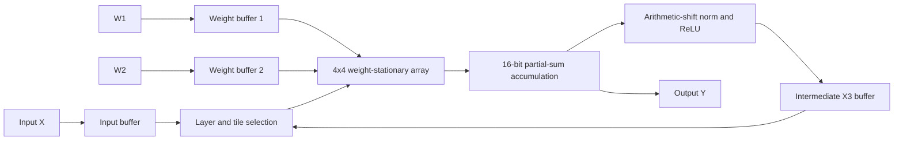

# Tiny Neural Network Accelerator

Verilog implementation of a compact inference accelerator for an `FC1 -> Norm -> ReLU -> FC2` network. A reusable 4x4 weight-stationary systolic array executes both fully connected layers through tiled matrix multiplication.

## Architecture



The controller divides each 8-wide matrix product into 4x4 tiles. Two K-dimension partial products are accumulated with a 16-bit carry-lookahead adder. FC1 results are normalized by an arithmetic right shift, passed through ReLU, and reused as FC2 inputs.

## RTL organization

The public RTL is kept in a single source file to preserve the original module hierarchy:

- `cla4`, `cla8`, `cla16`: hierarchical carry-lookahead adders.
- `mult4ss`, `mult4su`, `mult4uu`: signed and unsigned 4-bit partial multipliers.
- `mad8`: four-cycle 8-bit multiply-accumulate datapath.
- `se8`: weight-stationary systolic processing element.
- `sa8_4x4`: 16-element systolic array with input skewing and weight prefill.
- `ctrl`: memory loading, layer selection, tile scheduling, accumulation, activation, and writeback FSM.
- `top`: accelerator integration and external memory interface.

## Validation results

The original self-checking simulation compared every output against reference vectors:

| Mode | Batch size | Matched outputs | Cycles | Latency at 100 MHz |
| --- | ---: | ---: | ---: | ---: |
| Base | 8 | 64 / 64 | 1,387 | 13.87 us |
| Extra | 16 | 128 / 128 | 2,643 | 26.43 us |

Design estimates from the project analysis:

| Metric | Estimate |
| --- | ---: |
| Internal storage | 5,804 bits (0.726 kB) |
| Peak external bandwidth | 500 MB/s at 100 MHz |
| Peak compute throughput | 0.8 GOPS at 100 MHz |
| Useful-operation utilization | 18.5% base, 19.4% extra |

The throughput and bandwidth values are architectural estimates. Latency and output matching were measured in RTL simulation.

## Repository layout

```text
.
|-- docs/architecture.md
|-- docs/verification.md
`-- rtl/tiny_nn_accelerator.v
```

## Public scope

This repository contains only the accelerator RTL authored for the project and a portfolio-oriented technical summary. Course-provided templates, behavioral memory models, test vectors, testbench scaffolding, assignment documents, and the original report are intentionally excluded.

GitHub Actions compiles the public RTL with Icarus Verilog and checks the expected module hierarchy on every push.

## License

MIT
